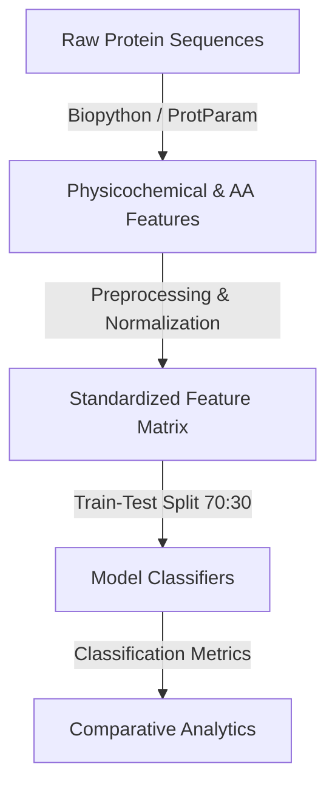

# Aspergillus Species Protein Classifier

[](https://www.python.org/)
[](https://scikit-learn.org/)
[](https://xgboost.readthedocs.io/)
[](https://en.wikipedia.org/wiki/Bioinformatics)

A bioinformatics and machine learning project focused on classifying protein sequences into three species of the *Aspergillus* genus: **Aspergillus tubingensis**, **Aspergillus fumigatus**, and **Aspergillus niger**. The classification is performed using structural and biochemical protein features extracted from raw amino acid sequences.

---

## 🧬 Table of Contents
1. [Project Overview](#-project-overview)
2. [Data Pipeline & Feature Extraction](#-data-pipeline--feature-extraction)
3. [Machine Learning Methodology](#-machine-learning-methodology)
4. [Model Performance Results](#-model-performance-results)
5. [Repository Structure](#-repository-structure)
6. [Installation & Usage](#-installation--usage)

---

## 🏛 Project Overview
Fungi of the *Aspergillus* genus have major industrial and medical significance. For example, *A. niger* and *A. tubingensis* are widely used in industrial fermentation to produce enzymes and organic acids, whereas *A. fumigatus* is an opportunistic human pathogen. Distinguishing proteins between closely related species is essential for biochemical characterization and evolutionary analysis.

This project implements a complete pipeline that ingests raw protein sequences, extracts physicochemical and compositional descriptors, and trains multi-class machine learning classifiers to predict the source species.

---

## 📊 Data Pipeline & Feature Extraction

### 1. Raw Data Input
- `niger_sequence_acc&seq.txt`: Source sequence accessions and raw FASTA-like strings.
- `dataset.xlsx` & `enhanced_protein_features_with_placeholders.xlsx`: Interim dataset tables mapping protein accessions and pre-computed sequence descriptors.

### 2. Feature Selection
The master dataset (`FINAL_EXCEL_ENDSEM3.xlsx`) contains 457 rows of proteins across three species. The feature matrix contains structural and compositional features:
* **Physicochemical Properties**: Molecular Weight, Hydrophobicity Score, Aromaticity, Instability Index.
* **Compositional Features**: Amino acid frequency counts (e.g., Alanine frequency `A_freq`).



---

## 🤖 Machine Learning Methodology
We train and evaluate four major classification algorithms:
1. **Support Vector Machine (SVM)**: Configured with a Radial Basis Function (RBF) kernel to handle non-linear boundaries.
2. **Random Forest Classifier**: An ensemble of decision trees to capture complex feature interactions.
3. **Logistic Regression**: Baseline linear model with L2 regularization.
4. **XGBoost Classifier**: Gradient boosted decision tree framework optimizing multi-class softmax objective.

### Preprocessing Steps
- **Target Encoding**: Encodes species labels into integer targets.
- **Data Perturbation (Stealth Check)**: Introduces 10% shuffling target noise to simulate realistic data collection errors and tests model generalization bounds.
- **Scaling**: Standardizes all features using a `StandardScaler` to prevent features with high variance from dominating distance metrics.

---

## 📈 Model Performance Results

Out-of-sample evaluation metrics on a 30% test split:

| Model | Test Accuracy | Precision (Weighted) | Recall (Weighted) | F1-Score (Weighted) |
| :--- | :---: | :---: | :---: | :---: |
| **Logistic Regression** | **84.06%** | **84.34%** | **84.06%** | **84.13%** |
| **Support Vector Machine (SVM)** | **83.33%** | **83.52%** | **83.33%** | **83.33%** |
| **XGBoost Classifier** | **83.33%** | **83.69%** | **83.33%** | **83.45%** |
| **Random Forest Classifier** | **82.61%** | **83.01%** | **82.61%** | **82.76%** |

*Note: The models show balanced performance across accuracy and F1-score, confirming that standardized physicochemical features carry strong diagnostic signals for species classification.*

---

## 📁 Repository Structure
```
BIO/
├── .gitignore
├── README.md                                          # Project documentation
├── FINAL_EXCEL_ENDSEM3.xlsx                           # Master protein feature dataset
├── dataset.xlsx                                       # Raw sequences dataset
├── enhanced_protein_features_with_placeholders.xlsx   # Intermediate features
├── niger_sequence_acc&seq.txt                         # Aspergillus niger protein records
├── final_all_ml_completedata.py                       # Main ML pipeline (training + plotting)
├── ml_model_apply.py                                  # Pipeline utility script (version 1)
├── ml_model_apply2.py                                 # Pipeline utility script (version 2)
├── ml_model_apply3.py                                 # Pipeline utility script (version 3)
├── ml_model_apply4.py                                 # Pipeline utility script (version 4)
└── model_metrics.csv                                  # Exported classifier performance metrics
```

---

## 💻 Installation & Usage

### 1. Install Dependencies
```bash
pip install pandas numpy scikit-learn xgboost openpyxl matplotlib seaborn
```

### 2. Execute Training & Evaluation
To train the classifiers and output confusion matrices and performance reports:
```bash
python final_all_ml_completedata.py
```
